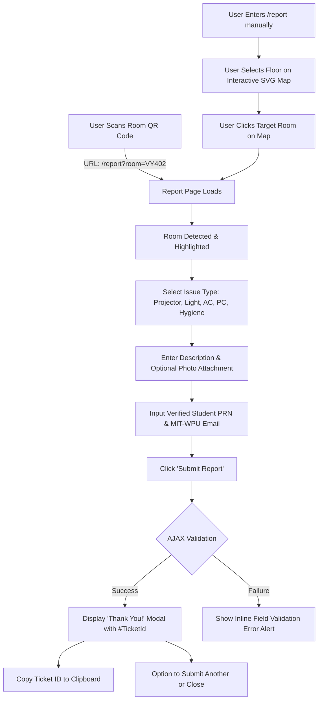
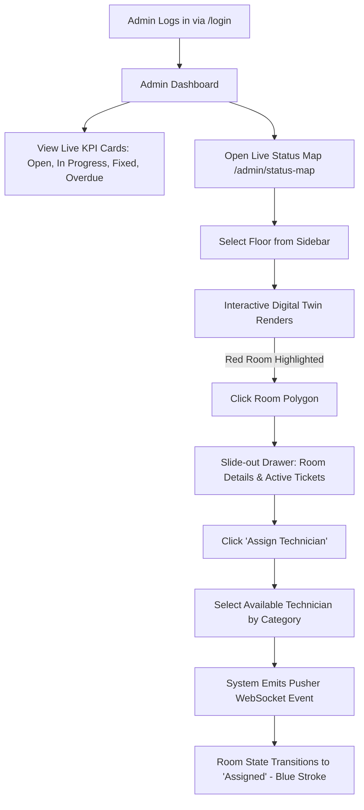
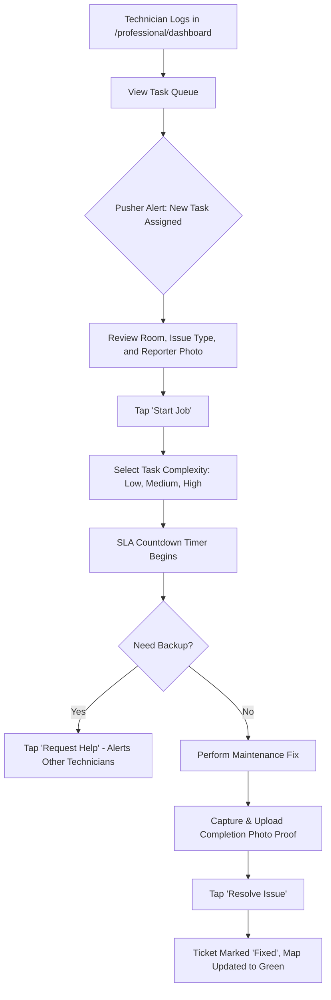
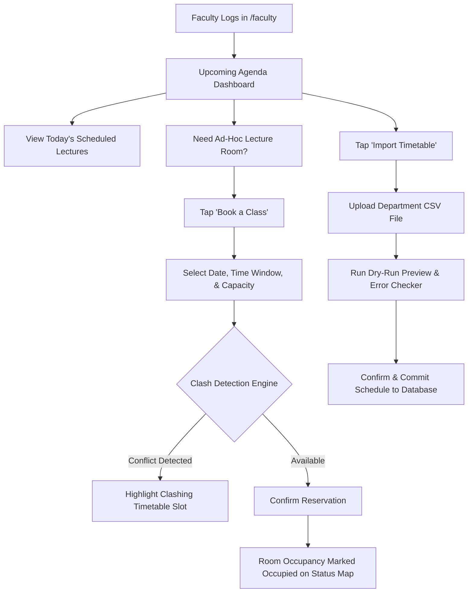

# Application Flow & UX Architecture (AppFlow)
## Project: FixLink — Interaction Models and User Journeys

---

## 1. Global Navigation & Layout Architecture

FixLink features an adaptive dual-navigation model tailored for both Desktop workstations and Mobile devices.

```
+-------------------------------------------------------------------------+
|                              Desktop View                               |
|  [Logo: MIT-WPU FixLink] [Home] [Report] [Status Map] [Faculty] [Theme] |
+-------------------------------------------------------------------------+

+-------------------------------------------------------------------------+
|                              Mobile View                                |
|  Top Header:    [FixLink Logo]                   [Bug Icon] [Theme Icon] |
|  Main Body:     [Active View / Form / Responsive Interactive SVG Map]   |
|  Bottom Nav:    [Home]     [Report]     [Map]     [Faculty]     [Profile]|
+-------------------------------------------------------------------------+
```

### 1.1 Responsive Mobile Header & Bottom Navigation
- **Mobile Top Bar (`#mobile-top-bar`):** Displays the MIT-WPU FixLink brand on the left and quick-action icon controls on the right:
  - **Theme Toggle Button:** One-tap switch between Light and OLED Dark mode.
  - **Bug Report Button (`#mobileBugBtn`):** Instantly triggers the floating Bug Report modal without leaving the current workflow.
- **Mobile Bottom Navigation:** Fixed bottom navigation bar providing primary tap targets for Home, Issue Reporting, Status Map, Faculty Schedule, and Account Profile.

---

## 2. Core User Flows & Journeys

### 2.1 Student / Visitor: Issue Reporting Flow


### 2.2 Facility Admin: Dispatch & Status Monitoring Flow


### 2.3 Technician (Professional): Work Order Lifecycle Flow


### 2.4 Faculty Portal: Timetable & Classroom Booking Flow


---

## 3. UI State Transitions & Feedback

| Component | Default State | Hover / Active State | Error State | Loading State |
| :--- | :--- | :--- | :--- | :--- |
| **SVG Room Polygon** | Low opacity fill (15%) with distinct boundary stroke. | Glow highlight (35% opacity), stroke expands to 3px. | Red flashing outline if critical issue open. | Shimmer skeleton loader across floor map container. |
| **Submit Buttons** | Solid MIT-WPU Blue pill button. | Darker shade, slight upward translateY(-2px). | Disabled with alert banner above form. | Rotating spinner with text "Submitting...". |
| **Status Badge** | Compact pill with status icon. | Tooltip displaying technician name or deadline. | Red `#dc3545` badge with warning icon. | Pulsing opacity badge during background sync. |
| **Ticket Reference Card** | Centered rounded card with `#0000`. | `#1042` with one-tap clipboard copy button. | `#----` fallback (zero `#undefined`). | Shimmer pulse before response parse. |
