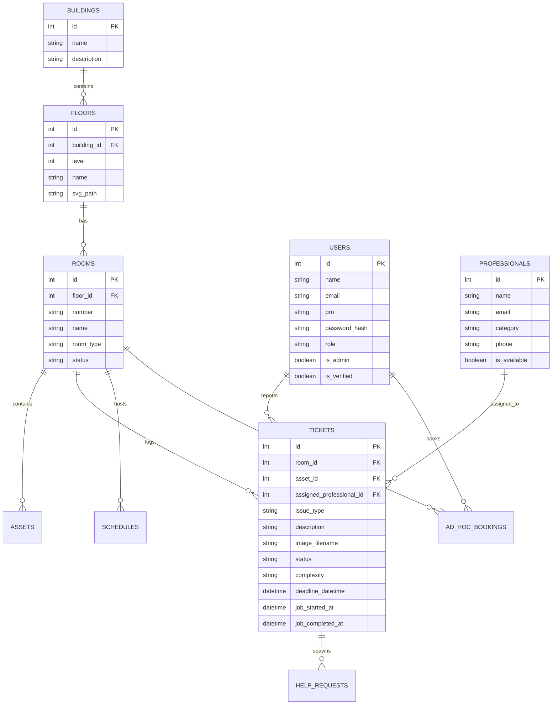

# Technical Specification (TechSpec)
## Project: FixLink — MIT-WPU Vyas Building Digital Twin Architecture

---

## 1. System Overview & Architecture

FixLink is engineered with a **Modular Flask Application Factory** pattern on the backend, complemented by a **Lightweight Vanilla Modern Web Frontend** utilizing SVG vector graphics, Bootstrap 5 utilities, and Pusher WebSocket channels for real-time synchronization.

```
                  +----------------------------------------------+
                  |               Client Browser                 |
                  |  (Vanilla JS ES Modules, SVG Digital Twin,  |
                  |     Bootstrap 5 UI, Touch Gesture Engine)    |
                  +----------------------+-----------------------+
                                         |  HTTPS / WSS
                                         v
                  +----------------------------------------------+
                  |         Web Application / Reverse Proxy       |
                  |        (Vercel Serverless / Gunicorn WSGI)   |
                  +----------------------+-----------------------+
                                         |
                                         v
                  +----------------------------------------------+
                  |             Flask 3.0 Core Engine            |
                  |  - Application Factory (`create_app`)        |
                  |  - Blueprints: main, admin, auth,            |
                  |    professional, superadmin, faculty         |
                  |  - CSRF Protection (Flask-WTF)               |
                  |  - In-Memory / Redis Cache (Flask-Caching)   |
                  +-----------+----------------------+-----------+
                              |                      |
            SQLAlchemy ORM    |                      | WebSockets API
                              v                      v
            +--------------------+         +--------------------+
            | PostgreSQL / Neon  |         | Pusher Channels    |
            | (Relational DB)    |         | (Real-time events) |
            +--------------------+         +--------------------+
```

---

## 2. Technology Stack Breakdown

### 2.1 Backend Core
- **Language:** Python 3.11+
- **Web Framework:** Flask `3.0.x`
- **WSGI / Server Toolkit:** Werkzeug `3.0.x`
- **ORM & Database Layer:** Flask-SQLAlchemy `3.1.x` / SQLAlchemy `2.0.x`
- **Database Migrations:** Flask-Migrate `4.0.x` (Alembic)
- **Security & Forms:** Flask-WTF `1.2.x` (CSRF token lifecycle and validation)
- **Caching Layer:** Flask-Caching `2.1.x` (Floor plan caching and query memoization)
- **Environment Management:** `python-dotenv`

### 2.2 Database Engine
- **Primary Production Database:** PostgreSQL (Neon Serverless PostgreSQL / Render / Supabase)
  - Connection Pooling: `NullPool` enabled for serverless Vercel environments to prevent connection exhaustion; standard recycle pool for dedicated servers.
- **Development / Fallback Database:** SQLite 3 (`fixlink.db`) with automatic table inspection and initialization.

### 2.3 Real-Time & Communications
- **WebSocket Engine:** Pusher Channels (`pusher>=3.3.0`)
  - Server: Dispatches events on channels `private-admin-notifications`, `room-status-updates`, and `professional-tasks`.
  - Client: `pusher-js 8.0.1` client library with dynamic channel subscriptions.
- **Push Notifications:** `pywebpush 2.0.x` (Web Push API / VAPID protocol)
- **Document Generation:** `fpdf2` (maintenance audit reports), `qrcode` (room QR code generator), `pandas` (timetable CSV ingestion).

### 2.4 Frontend Stack
- **Structure:** Semantic HTML5 templates rendered via Jinja2 template inheritance (`base.html`).
- **Styling (CSS):**
  - Custom CSS Design System (`style.css` / `style.min.css`) utilizing native CSS Custom Properties (`:root` and `[data-theme="dark"]`).
  - Bootstrap `5.3.x` framework loaded locally for grid layout and components without external CDN blocking.
  - Zero Tailwind dependencies (100% Vanilla CSS for fine control and performance).
- **Client-Side Logic (JavaScript):**
  - Native JavaScript ES Modules (`/static/js/modules/*.js`) with dynamic imports (`api.js`, `render.js`, `ui.js`, `admin_map.js`, `main.js`).
  - Native Touch Event Engine: Two-finger pinch-to-zoom calculation, midpoint translation, and single-finger zoomed drag panning.
- **Iconography & Animation:**
  - Bootstrap Icons `1.11.x` (SVG font vector icons).
  - GSAP (GreenSock Animation Platform) for smooth card entry and side panel drawer transitions.
  - SweetAlert2 for modern interactive alert dialogues.

---

## 3. Database Schema Architecture



---

## 4. API Endpoints Specification

### 4.1 Digital Twin & Map Data
| Method | Endpoint | Access | Description |
| :--- | :--- | :--- | :--- |
| `GET` | `/api/floors/<int:building_id>` | User/Auth | Returns list of floors for a building. |
| `GET` | `/api/rooms/floor/<int:floor_id>` | User/Auth | Cached room list and status metrics for SVG rendering. |
| `GET` | `/api/room/<room_number>` | User/Auth | Returns detailed room metadata and active issue states. |
| `GET` | `/admin/floor-data/<int:floor_id>` | Admin | Returns comprehensive room, asset, and ticket payloads. |

### 4.2 Maintenance Reporting & Tickets
| Method | Endpoint | Access | Description |
| :--- | :--- | :--- | :--- |
| `POST` | `/report` | Public/Auth | Creates a maintenance ticket with optional image upload. Returns JSON with `ticket_id`. |
| `GET` | `/admin/api/ticket/<int:ticket_id>` | Admin | Retrieves ticket details, timestamps, and assignee info. |
| `POST` | `/admin/api/ticket/<int:ticket_id>/assign` | Admin | Assigns a professional to the ticket and triggers Pusher event. |
| `POST` | `/api/task/<int:ticket_id>/start` | Professional | Starts technician work timer. |
| `POST` | `/api/task/<int:ticket_id>/complete` | Professional | Submits completion photo proof and marks ticket as `fixed`. |

### 4.3 Faculty Scheduling & Bookings
| Method | Endpoint | Access | Description |
| :--- | :--- | :--- | :--- |
| `GET` | `/faculty/api/occupancy` | Faculty | Real-time vacant/occupied state of all rooms across floors. |
| `POST` | `/faculty/api/book` | Faculty | Reserves a vacant room for a specific time window with clash verification. |
| `POST` | `/faculty/api/sync` | Faculty | Synchronizes personal faculty timetable. |

---

## 5. Security & Reliability Protocols

1. **CSRF Enforcement:** All mutable requests (`POST`, `PUT`, `DELETE`) require a valid CSRF token generated via `csrf_token()` or supplied in the `X-CSRFToken` header.
2. **Strict Session Configuration:** Cookies are configured with `HttpOnly=True`, `SameSite=Lax`, and 24-hour expiration (`PERMANENT_SESSION_LIFETIME = 86400`).
3. **Database Initialization Safety:** Database access checks table existence before querying via `sqlalchemy.inspect(db.engine).has_table()` to guarantee resilience during cold starts on serverless platforms.
4. **File Upload Hardening:** Uploads restricted to 16MB max, sanitized via `secure_filename()`, and strictly checked for permitted image extensions (`.png`, `.jpg`, `.jpeg`, `.webp`).
